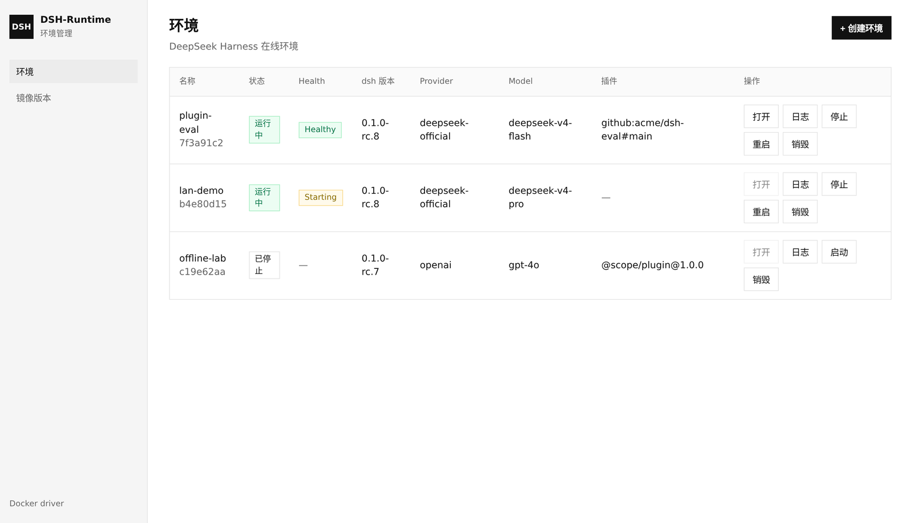
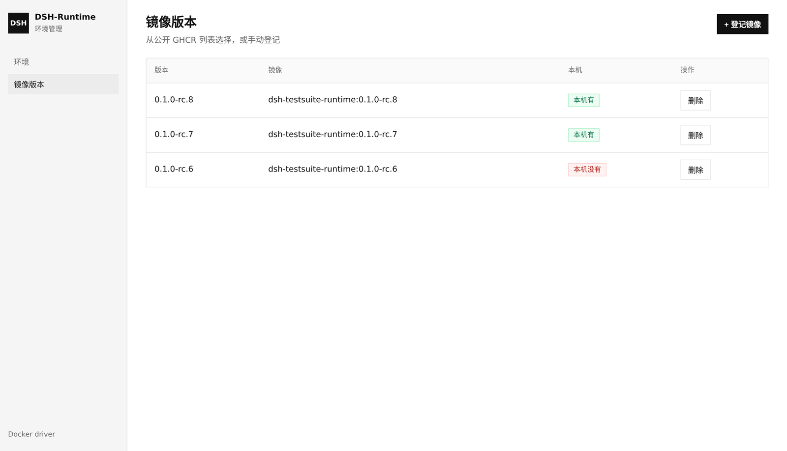
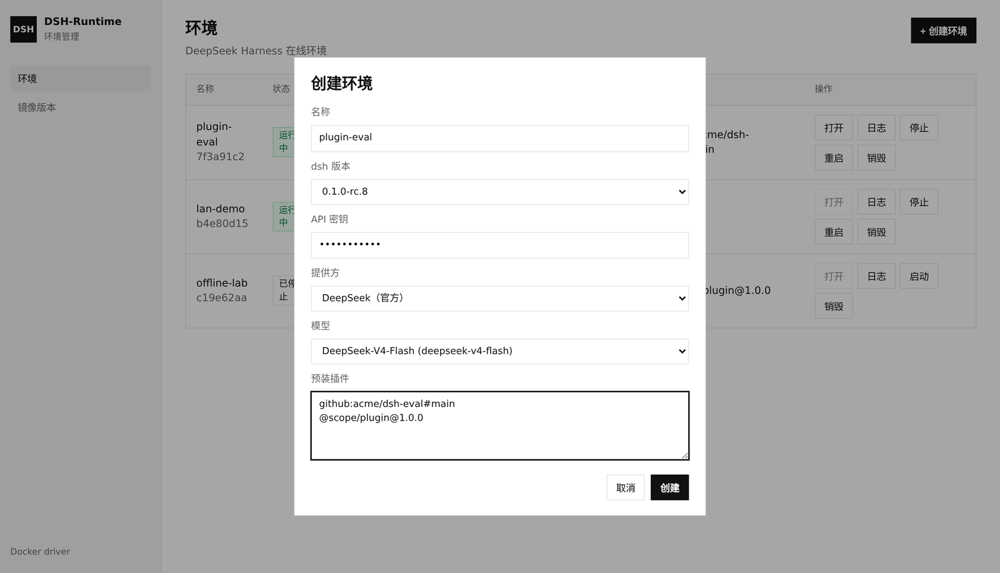

# dsh-testsuite

[](https://github.com/cocofhu/dsh-testsuite/actions/workflows/ci.yml)
[](LICENSE)

给 [DeepSeek Harness](https://github.com/deepseek-ai/deepseek-harness) 插件准备可复用的在线测试环境。按版本预构建 runtime 镜像，在管理台登记后创建 Docker 容器，注入 API Key、提供方、模型和预装插件，然后打开 `dsh web`。



本项目是非官方工具，不是 DeepSeek Harness 的官方产品。

## 怎么工作

- **控制面**（本仓库 Go 服务 + Web UI）：登记镜像，创建 / 启停 / 重启 / 销毁环境，看日志。
- **Runtime 镜像**（每版本一份 `image/<ver>/Dockerfile`）：在平台外用 `make image` 构建，或从 GitHub Release 推到 GHCR。已发布 tag 默认冻结。说明见 [docs/images.md](docs/images.md)。

每个环境把容器内 `3080` 映射到宿主机随机端口。容器进入 `running` 后还会探测端口，Health 变为 Healthy 才允许「打开」（dsh Web 是根路径 SPA，启动还要几秒）。

镜像预先构建好，创建环境只选已登记镜像并注入配置。默认用 Docker；也可把 `runtime` 设为 `kubernetes`，由控制面在集群里创建 Deployment / Service / Ingress（见下方）。**控制面不执行 docker build。** Docker 模式下，登记镜像时若本机没有该 tag，会从 GHCR 自动 pull。

## 快速开始

需要 Docker 和 Go 1.25+。

```bash
make image DSH_VERSION=0.1.1-rc.2    # 在平台外打 runtime；细节见 docs/images.md
cp config.example.yaml config.yaml   # 本地配置，不要提交
make run                             # 控制面 http://127.0.0.1:8090
```

1. 打开「镜像版本」，选版本登记（本机没有会从 GHCR 自动 pull）。也可只 pull、稍后登记：`docker pull ghcr.io/cocofhu/dsh-testsuite-runtime:0.1.1-rc.2`。
2. 在「模型预设」填提供方、模型和 API 密钥（密钥只存在本机 `data/`）。
3. 回到「环境」，创建并等待 Health 变为 Healthy，再点「打开」。



首次推到 GHCR 的包默认是 private，需要在 GitHub Packages 设为 public。

用 Compose 把控制面也跑进容器（需挂 docker.sock；runtime 仍在宿主机构建或 pull）：

```bash
make image DSH_VERSION=0.1.1-rc.2
docker compose up --build
```

## 创建环境



| 字段 | 说明 |
|---|---|
| dsh 版本 | 只能选「镜像版本」里已登记的条目 |
| 模型预设 | 在「模型预设」页在线填写（含 API 密钥）。创建环境时选预设即带上密钥，或选「手动填写」 |
| API 密钥 | 预设里保存；手动创建时现填。注入为 `DSH_API_KEY`；官方 provider 同时设 `DEEPSEEK_API_KEY`。列表只显示末 4 位 |
| Provider / Model | 写在预设里，或「手动填写」时现选。仅「自定义…」才填 Provider ID / API 地址 |
| 预装插件 | 每行一个 pnpm 源，如 `github:owner/plugin#main`。git 源的 `prepare` 会由 runtime 写入 profile 的 `allowBuilds` |

空闲 TTL 默认 2 小时（`limits.idleTTL`），超时会销毁容器和该环境的 `$DSH_HOME`。列表显示剩余 TTL，点「续期 6h」会从当前到期时间再延 6 小时。

控制面默认无认证，不要把 `:8090` 裸暴露到公网。`config.yaml` 和 `data/` 含密钥，已 gitignore。

## Kubernetes

把 `runtime` 设为 `kubernetes` 后，每个环境是同命名空间里的 Deployment + Service + Ingress，不再映射宿主机随机端口。

- `kubernetes.envHostTemplate` **必填**，且必须包含 `{id}`。控制面用它生成「打开」链接和 `DSH_TRUSTED_HOST`。dsh Web 是根路径 SPA，需要每个环境一个主机名（自备通配 DNS），例如 `env-{id}.example.com`。
- `namespace` 留空则使用 in-cluster 当前命名空间；集群外可填 `kubeconfig`。
- `ingressClass` 可选（例如 `nginx`）。未填则用集群默认 IngressClass。
- 登记镜像只写目录；kubelet 拉镜像。填写 `kubernetes.storageClass` 后，`/data/dsh` 与 `/workspace` 挂在同一块 PVC 的 `home` / `workspace` 子目录；**销毁环境时删除 PVC**（不保留、不按名复用卷）。未填 storageClass 时退回 emptyDir。
- `docker.cpuCores` / `docker.memoryMB` 是容器 **limit**。可选的 `kubernetes.cpuRequest` / `kubernetes.memoryRequest` 只影响调度预留；不填则 request 等于 limit。
- 控制面 ServiceAccount 需要对本命名空间的 `deployments`、`pods`、`pods/log`、`services`、`secrets`、`ingresses` 的读写权限。

```yaml
runtime: kubernetes
server:
  publicHost: testsuite.example.com
docker:
  imageRepository: ghcr.io/cocofhu/dsh-testsuite-runtime
kubernetes:
  envHostTemplate: "env-{id}.example.com"
  ingressClass: nginx
```

## 远程访问

从浏览器访问这台机器的 IP 时：

1. `docker.bindIP` 设为 `0.0.0.0`，否则端口只绑在 127.0.0.1，外网会 `ERR_EMPTY_RESPONSE` / 连不上。
2. `server.publicHost` 填这台机器的 IP 或域名（也可用 `DSHTS_PUBLIC_HOST`）。「打开」链接和容器内 `dsh --trusted-host` 都用它。
3. 上游 dsh 拒绝 `--host 0.0.0.0`。runtime 让 dsh 听 `127.0.0.1:3081`，entrypoint 再用 TCP 代理转到容器 `3080` 给 `docker -p`。
4. 用 IP + HTTP 打开时浏览器不是 secure context，没有 `crypto.randomUUID`。镜像会注入 polyfill（与社区 [dsh-web-lan-access](https://github.com/AcidGr/dsh-web-lan-access) 同一思路），并把设置 / 凭证 API 放到 `--trusted-host` 上，否则模型页会报 `settings are unavailable in this browser`。

```bash
cp config.example.yaml config.yaml
# 编辑 server.publicHost
export PATH="/usr/local/go/bin:$PATH"
go run ./cmd/dsh-testsuite -config config.yaml
```

## API

```
GET    /healthz
GET    /api/providers
GET    /api/presets
POST   /api/presets                 { name, provider, model, apiKey, baseURL?, api? }
PUT    /api/presets/:id             apiKey 留空则不改密钥
DELETE /api/presets/:id
GET    /api/images
GET    /api/images/remote           内置可选版本列表
POST   /api/images                  { "version": "0.1.1-rc.2", "ref"?: "...", "pull"?: true }
                                    默认 pull=true；短名会 pull GHCR 再 tag 成本地 imageRepository:version
DELETE /api/images/:version
POST   /api/environments            { name, dshVersion, presetId? } 或手动 { apiKey, provider, model, ... }
GET    /api/environments
GET    /api/environments/:id
POST   /api/environments/:id/start
POST   /api/environments/:id/stop
POST   /api/environments/:id/restart
POST   /api/environments/:id/renew    到期时间再延 6 小时
DELETE /api/environments/:id
GET    /api/environments/:id/logs
```

## MCP

控制面同进程同端口内嵌 MCP（Model Context Protocol）Streamable HTTP 端点，把上表全部能力以 MCP 工具暴露给 AI Agent：

```
http://<host>:8090/mcp
```

支持 `initialize` / `ping` / `tools/list` / `tools/call`（Streamable HTTP，协议版本 2025-03-26 及以上）。工具面与 REST 完全等价、共用同一份存储——Agent 经 MCP 创建的环境立即可在 Web UI / REST 中看到，反之亦然。

| 分类 | 工具 |
| --- | --- |
| 环境（9） | `list_environments` `create_environment` `get_environment` `start_environment` `stop_environment` `restart_environment` `renew_environment`（+6h）`destroy_environment` `get_environment_logs`（`tail` 可选） |
| 镜像（4） | `list_images` `list_remote_images` `register_image`（`pull` 默认 true）`delete_image` |
| 预设（4） | `list_presets` `create_preset` `update_preset`（`apiKey` 留空不改）`delete_preset` |
| Provider（1） | `list_providers` |

参数带 JSON Schema 描述，Agent 可零文档发现；`not found` / `conflict` / 参数校验等错误都映射为 MCP tool error（`isError: true`）并保留原始错误文本。密钥规则与 REST 一致：任何工具响应只回显末 4 位。

MCP 客户端配置示例（Claude Code 等 Streamable HTTP 客户端通用）：

```json
{
  "mcpServers": {
    "dsh-testsuite": {
      "type": "http",
      "url": "http://<host>:8090/mcp"
    }
  }
}
```

> ⚠️ **安全提示**：与 REST 控制面一致，`/mcp` **没有任何认证**。绝不要把该端口暴露到公网；请通过内网 / 端口转发访问，否则任何能连到该端口的人都可以读取容器日志、用已存的密钥创建环境，甚至销毁全部环境。

## 配置

见 [config.example.yaml](config.example.yaml)。`docker.imageRepository` 只在登记时没填 `ref` 时用来拼默认 `仓库:版本`。

## 参与贡献

见 [CONTRIBUTING.md](CONTRIBUTING.md)。安全问题请按 [SECURITY.md](SECURITY.md) 私下报告。

## 许可证

[MIT](LICENSE)
